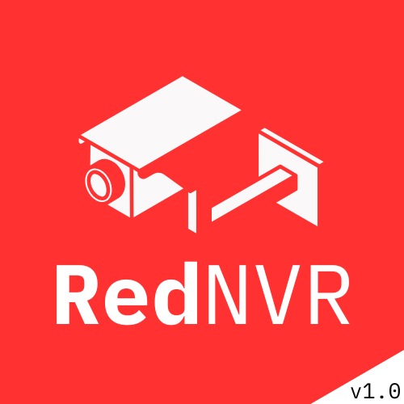

<p align="center">
  
</p>


RedNVR is a modern, user-friendly Network Video Recorder (NVR) application built with PyQt5. It offers a beautiful dark-themed interface, seamless camera management, and effortless video recording for your security needs.

## Features
- ✨ Sleek and modern dark UI
- 📷 Multi-camera support
- 🎥 Easy video recording management
- ⚡ Fast and responsive performance
- 🛠️ Simple setup and configuration

## Getting Started

### 1. Install Dependencies
Make sure you have Python 3.7+ installed. Then, install the required packages:
   ```powershell
   pip install -r requirements.txt
   ```

### 2. Run the Application
Start RedNVR with:
   ```powershell
   python main.py
   ```

## Build Standalone EXE
To create a single-file Windows executable using PyInstaller:
```powershell
pyinstaller --noconfirm --onefile --windowed --icon=assets/icons/rednvr.ico --name rednvr main.py
```
The output will be at `dist/rednvr.exe`.

> **Note:**
> - Place the `assets/`, `config/`, and other required folders next to the EXE for full functionality.
> - `logs/` and `recordings/` folders are created automatically at runtime.

## Folder Structure
```
assets/           # Icons and images
config/           # Configuration files (e.g., cameras.json)
core/             # Core logic (app config, camera manager, etc.)
logs/             # Log files (auto-generated)
recordings/       # Video recordings (auto-generated)
ui/               # UI components
main.py           # Application entry point
requirements.txt  # Python dependencies
```

## Contributing
Contributions are welcome! Feel free to open issues or submit pull requests to improve RedNVR.

## License
See the LICENSE file for license information.
